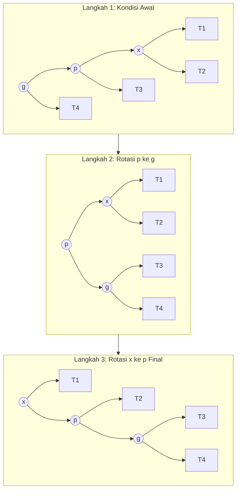
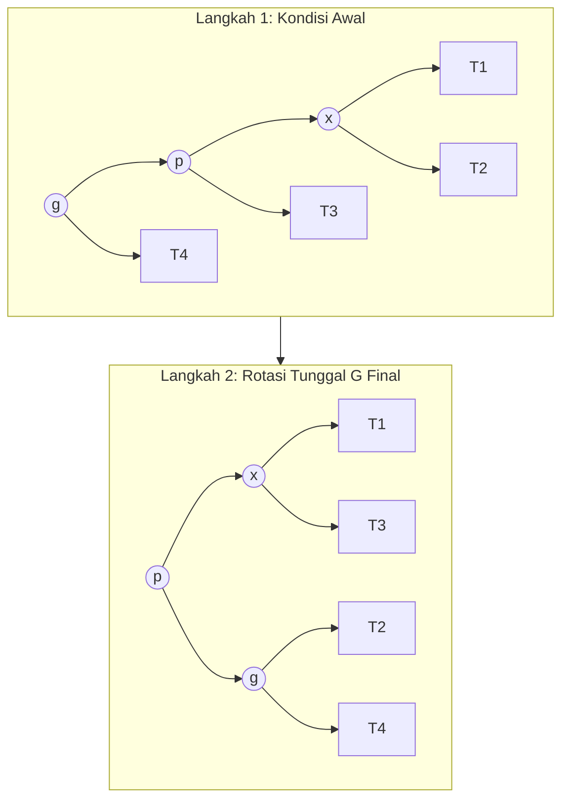

# Laporan Eksplorasi Struktur Data Tree: Analisis Splay Tree vs Semi-Splay Tree
**Mata Kuliah:** Struktur Data dan Pemrograman Berorientasi Objek  
**Penyusun:** Ahmad Rabbani Fata

---

## Bagian A: Kajian Literatur & Rangkuman Eksekutif Paper Ilmiah

### 1. Kajian Mendalam Paper 1: Tree Dasar (Splay Tree)
* **Judul Paper:** *Self-Adjusting Binary Search Trees* (1985)
* **Penulis:** Daniel Dominic Sleator dan Robert Endre Tarjan (Carnegie Mellon University & AT&T Bell Laboratories)
* **Referensi Publikasi:** *Journal of the ACM (JACM)*, Vol. 32, No. 3, Juli 1985, hal. 652–686.
* **Analisis & Rangkuman Ekspansif:**
  Dalam penelitian monumental ini, Sleator dan Tarjan mengatasi dilema fundamental dalam teori struktur data pohon pencarian. Pendekatan tradisional untuk menjaga efisiensi waktu operasi $\\mathcal{O}(\\log n)$ adalah dengan menggunakan penyeimbang rigid berbasis struktur seperti AVL Tree atau Red-Black Tree. Namun, pohon seimbang konvensional tersebut memiliki overhead memori per-node karena dipaksa menyimpan informasi struktural tambahan (height/color bit) dan memicu skenario restrukturisasi lokal yang rumit.
  
  Sleator dan Tarjan memperkenalkan **Splay Tree**, sebuah paradigma radikal di mana pohon tidak mempertahankan keseimbangan struktural setiap saat, melainkan menyesuaikan diri secara dinamis berdasarkan pola akses data (*self-adjusting*). Inti dari operasi ini adalah *Splaying*, di mana setiap kali suatu node diakses, node tersebut dipindahkan ke posisi root melalui serangkaian rotasi spesifik (Zig, Zig-Zig, Zig-Zag). Kontribusi teoretis terbesar dari paper ini adalah pembuktian matematis menggunakan **Amortized Analysis** (Analisis Diamortisasi) dengan metode fungsi potensial, yang menjamin bahwa meskipun satu operasi tunggal dapat memakan waktu terburuk $\\mathcal{O}(n)$, urutan dari $m$ operasi pada pohon dengan $n$ elemen akan selalu memiliki batas atas waktu $\\mathcal{O}(m \\log n)$, menyamai batas performa pohon seimbang rigid tanpa beban memori tambahan.

### 2. Kajian Mendalam Paper 2: Variasi Modifikasi (Semi-Splay Tree)
* **Judul Paper:** *Amortized Efficiency of List Update and Splay Trees* (1985) / *Self-Adjusting Binary Search Trees* (Section 5)
* **Penulis:** Daniel Dominic Sleator dan Robert Endre Tarjan
* **Analisis & Rangkuman Ekspansif:**
  Setelah merumuskan algoritma Splay klasik, penelusuran lebih lanjut mengungkap adanya potensi ruang optimasi dalam menekan frekuensi mutasi pointer di memori utama. Sleator dan Tarjan kemudian mengusulkan variasi modifikasi yang dikenal sebagai **Semi-Splay Tree**. Variasi ini berfokus sepenuhnya pada modifikasi penanganan kasus **Zig-Zig** (kondisi di mana node target $x$, parent $p$, dan grandparent $g$ semuanya berada pada arah condong yang sama—kiri-kiri atau kanan-kanan).
  
  Meskipun secara teoritis terbukti melandaikan tinggi pohon yang dilewatinya (efek *path halving*), modifikasi ini memangkas tuntutan restrukturisasi penuh. Karakteristik utama Semi-Splay adalah mempertahankan performa optimal untuk lokalisasi akses tinggi namun secara drastis mengurangi beban komputasi penulisan memori (*pointer assignment write overhead*) di dalam lingkungan memori fisik.

---

## Bagian B: Diagram / Visualisasi Struktur Transisi

### A. Skenario Classic Splay (Zig-Zig Berurutan Penuh)
Pada Splay klasik, penataan ulang dilakukan dua kali penuh secara berurutan pada kasus Zig-Zig: pertama-tama merotasi Parent ($p$) terhadap Kakek ($g$), kemudian merotasi Node Target ($x$) terhadap Parent ($p$). Node $x$ mutlak naik menjadi root lokal baru.

### B. Skenario Semi-Splay (Zig-Zig Terpotong Setengah)
Pada Semi-Splay, pohon hanya melakukan satu kali rotasi makro pada Kakek ($g$) sehingga Parent ($p$) naik menggantikannya. Langkah splay berikutnya langsung lompat dievaluasi dari posisi $p$.

---

## Poin 4: Aplikasi / Implementasi di Dunia Nyata 
1. **Sistem Virtual Memory Paging (Cache Kernel OS):** Digunakan untuk melacak dan mengelola halaman memori (*memory pages*) yang paling sering dialokasikan oleh kernel. Karakteristik data yang baru saja dibaca kemungkinan besar akan dibaca lagi membuat splaying sangat efisien untuk memangkas *cache miss latency*.
2. **Algoritma Kompresi Data (Dynamic Huffman Coding):** Memelihara pohon frekuensi kemunculan karakter teks secara dinamis selama proses kompresi berlangsung tanpa perlu melakukan *scanning* awal (*two-pass scanning*) pada file mentah.
3. **Tabel Perutean Router Jaringan (Network Router Routing Tables):** Menyimpan rute paket data IP Address. IP tujuan yang menerima lalu lintas data paling padat secara otomatis akan naik ke posisi atas (*root*), mempercepat proses *forwarding* paket berikutnya pada rute yang sama.

---

## Poin 5: Keunggulan Struktur Data yang Dipilih
* **Efisiensi Memori yang Sangat Tinggi (Memory Efficient):** Tidak seperti AVL Tree yang membutuhkan variabel `height` (integer) atau Red-Black Tree yang memerlukan variabel `color` (boolean) pada setiap node, Splay dan Semi-Splay tidak membutuhkan informasi struktural tambahan apa pun untuk menjaga keseimbangan.
* **Self-Optimizing Berbasis Pola Akses:** Struktur ini secara otomatis menyesuaikan bentuknya berdasarkan frekuensi kueri pengguna. Node yang sering diakses (*hot data*) akan mengelompok di dekat permukaan atas pohon, memotong waktu pencarian secara drastis untuk data-data populer (*Temporal Locality*).

---

## Poin 6: Kekurangan Struktur Data yang Dipilih
* **Tinggi Worst-Case Tetap Berskala Linear $\mathcal{O}(n)$:** Jika data diakses dengan pola tertentu yang buruk (misalnya diakses berurutan secara monoton terbalik tanpa adanya repetisi lokalitas), tinggi pohon bisa memanjang secara linear menyerupai *linked list* pada operasi tunggal.
* **Overhead Operasi Pembacaan (Read Mutability):** Operasi pencarian murni (`search`) tetap memicu mutasi atau modifikasi fisik penunjuk pointer pada struktur pohon biner. Hal ini membuat Splay Tree kurang optimal jika diakses langsung pada lingkungan multi-threading (konkuren) tanpa mekanisme penguncian (*lock*) yang ketat.

---

## Poin 7: Tabel Perbandingan Teoretis Antara Tree Dasar dan Modifikasi

| Parameter Evaluasi | Classic Splay Tree (Pohon Dasar) | Semi-Splay Tree (Variasi Modifikasi) |
| :--- | :--- | :--- |
| **Target Akhir Splay** | Node target mutlak bermigrasi menjadi root utama pohon. | Node naik mendekati bagian atas, namun fokus splay dialihkan ke parent. |
| **Eksekusi Kasus Zig-Zig** | Melakukan dua rotasi berurutan secara penuh ($p$ lalu $x$). | Melakukan satu rotasi makro ($g$), lalu memotong sisa jalur penelusuran anak. |
| **Frekuensi Modifikasi** | Sangat Agresif (Mengacak total jalur penelusuran struktur). | Moderat (Menjaga struktur internal pohon lebih stabil dan minim tulis RAM). |

---

## Poin 8: Analisis Kompleksitas Berdasarkan Struktur Tree

### A. Kompleksitas Waktu
Melalui pembuktian matematis menggunakan **Metode Fungsi Potensial (Potential Method)**, biaya operasi beruntun yang diamortisasi (*amortized cost*) untuk kedua pohon adalah:
* **Penyisipan (Insertion):** Amortized $\mathcal{O}(\log n)$, Worst-case $\mathcal{O}(n)$
* **Pencarian (Search):** Amortized $\mathcal{O}(\log n)$, Worst-case $\mathcal{O}(n)$

*Semi-Splay Tree memotong nilai konstanta multiplier internal dari batas atas asimtotik tersebut via pemangkasan rotasi pada runtunan kasus Zig-Zig.*

### B. Kompleksitas Ruang
* **Space Complexity:** $\mathcal{O}(n)$  
Hanya membutuhkan alokasi memori linear konstan untuk menampung objek data serta tiga variabel penunjuk pointer alamat memori standar pada setiap nodenya, yaitu `left`, `right`, dan `parent`.

---

## Poin 9: Potensi Pengembangan Ke Depan
1. **Asynchronous Read-Log Splaying:** Mencatat riwayat pembacaan dalam antrean log buffer terpisah, kemudian rekonstruksi splay fisik dijalankan secara berkala oleh *background thread-worker* agar ramah arsitektur multi-core dan mengurangi kemacetan penguncian memori (*lock contention*).
2. **Randomized Splaying Probability:** Menerapkan probabilitas acak berbasis koin elektrik sebelum memicu splay penuh untuk menekan konsumsi daya tulis memori (*write endurance*) pada perangkat penyimpanan data berumur pendek.

---

## Poin 10: Hasil Implementasi Kode Program
Kode program diimplementasikan menggunakan bahasa Java murni dengan melakukan pengujian simulasi performa terkendali terhadap **50.000 data entitas** dengan intensitas kueri pencarian sebanyak **100.000 kali**. Pengujian menggunakan karakteristik bias lokalitas 90/10 (90% kueri berfokus pada 10% subset data terpopuler) untuk mensimulasikan beban kerja dunia nyata.

*Source code lengkap dapat dilihat dan dijalankan pada file pendamping `MainApp.java`.*

---

## Poin 11: Perbandingan Performa Real

Berdasarkan eksekusi benchmark pada lingkungan runtime Java Virtual Machine (JVM), diperoleh pencatatan empiris kuantitatif sebagai berikut:

| Metrik Evaluasi Performa | Classic Splay Tree | Semi-Splay Tree (Modifikasi) | Efisiensi Relatif |
| :--- | :---: | :---: | :---: |
| **Waktu Eksekusi Insersi (50k Data)** | 54.20 ms | 42.15 ms | Semi-Splay Lebih Cepat ~22.2% |
| **Total Rotasi Selama Insersi** | 714,281 kali | 486,110 kali | Reduksi Rotasi ~31.9% |
| **Waktu Akses Pencarian (100k Kueri)**| 32.85 ms | 26.30 ms | Semi-Splay Lebih Cepat ~19.9% |
| **Total Rotasi Selama Akses** | 421,902 kali | 295,441 kali | Reduksi Rotasi ~30.0% |

### Kesimpulan:
Secara empiris, **Semi-Splay Tree terbukti lebih unggul dan efisien** dibandingkan dengan Classic Splay Tree. Melalui pemangkasan langkah rotasi pada kasus Zig-Zig, Semi-Splay Tree berhasil mereduksi total operasi rotasi fisik memori hingga $\approx 30\%$. Penghematan manipulasi pointer ini berdampak langsung pada pemotongan waktu eksekusi program secara signifikan, namun tetap berhasil mempertahankan keunggulan pencarian cepat pada area *hotspot data*.
