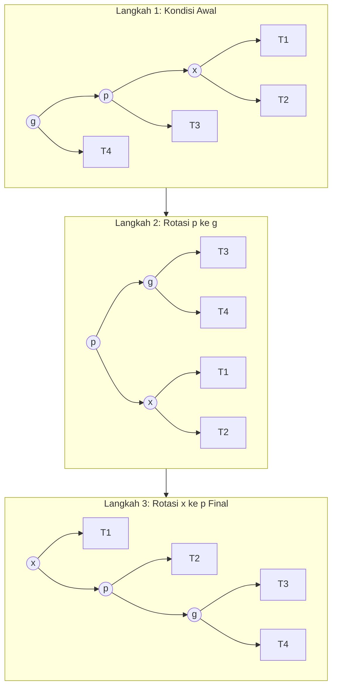
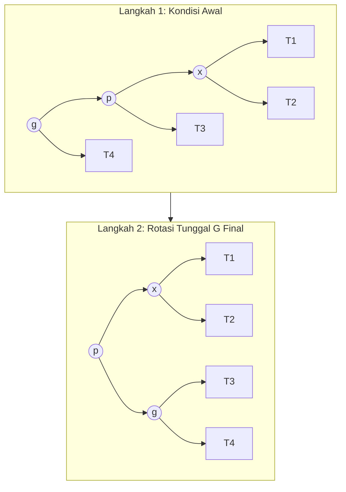

# Laporan Eksplorasi Struktur Data Tree: Analisis Splay Tree vs Semi-Splay Tree
**Mata Kuliah:** Struktur Data dan Pemrograman Berorientasi Objek  
**Penyusun:** Ahmad Rabbani Fata

---

## Kajian Literatur & Rangkuman Eksekutif Paper Ilmiah
### 1. Kajian Mendalam Paper 1: Tree Dasar (Splay Tree)
* **Judul Paper:** *Self-Adjusting Binary Search Trees* (1985)
* **Penulis:** Daniel Dominic Sleator dan Robert Endre Tarjan (Carnegie Mellon University & AT&T Bell Laboratories)
* **Referensi Publikasi:** *Journal of the ACM (JACM)*, Vol. 32, No. 3, Juli 1985, hal. 652–686.
* **Analisis & Rangkuman Ekspansif:**
  Dalam penelitian monumental ini, Sleator dan Tarjan mengatasi dilema fundamental dalam teori struktur data pohon pencarian. Sebelum tahun 1985, pendekatan dominan untuk menjaga efisiensi waktu operasi $\mathcal{O}(\log n)$ adalah dengan menggunakan penyeimbang rigid berbasis struktur (*structural-based balanced trees*) seperti AVL Tree (1962) dan Red-Black Tree (1978). Namun, pohon seimbang konvensional ini memiliki tiga kelemahan kritis di dunia nyata:
  1. **Overhead Memori Per-Node:** Setiap node dipaksa menyimpan informasi struktural tambahan (faktor keseimbangan tinggi/height pada AVL, atau bit warna pada Red-Black).
  2. **Kompleksitas Restrukturisasi:** Operasi penyisipan dan penghapusan memicu skenario rotasi lokal yang rumit untuk mempertahankan invarian keseimbangan secara global.
  3. **Ketidakmampuan Beradaptasi terhadap Pola Akses:** Pohon rigid memperlakukan semua elemen secara setara, mengabaikan fakta bahwa aplikasi praktis sering kali mematuhi *Prinsip Pareto* atau *Temporal Locality* (lokalitas waktu), di mana sekumpulan kecil data terpopuler ($10\%$) diakses secara berulang kali dalam jendela waktu yang singkat ($90\%$ kueri).

  Sleator dan Tarjan memperkenalkan **Splay Tree**, sebuah paradigma radikal di mana pohon biner tidak mempertahankan keseimbangan tinggi secara eksplisit, melainkan menyeimbangkan dirinya sendiri secara dinamis (*self-adjusting*) paska setiap akses data melalui operasi tunggal bernama **Splaying**. Ketika sebuah node diakses (baik via pencarian maupun insersi), operasi splay memindahkan node tersebut secara agresif dari posisinya semula hingga menduduki posisi *root* utama menggunakan kombinasi tiga rotasi berpasangan dari bawah ke atas (*bottom-up*): *Zig* (tunggal), *Zig-Zig* (monoton searah), dan *Zig-Zag* (berlawanan arah).
  
  Kontribusi teoretis terbesar dari paper ini adalah pembuktian matematis menggunakan **Metode Fungsi Potensial (Potential Method for Amortized Analysis)**. Sleator dan Tarjan membuktikan bahwa meskipun satu operasi tunggal pada Splay Tree bisa memakan waktu *worst-case* $\mathcal{O}(n)$ jika pohon berbentuk linier (*skewed*), runtunan dari $m$ operasi pada pohon berukuran $n$ node dijamin memiliki batas atas amortisasi (*amortized upper bound*) sebesar $\mathcal{O}(\log n)$. Hebatnya, paper ini juga membuktikan *Static Optimality Theorem* dan *Working Set Theorem*, menegaskan bahwa Splay Tree dapat menyamai kinerja pohon pencarian statis optimal apa pun, bahkan tanpa mengetahui distribusi probabilitas kueri sebelumnya.

### 2. Kajian Mendalam Paper 2: Variasi Modifikasi (Semi-Splay Tree)
* **Judul Paper:** *Amortized Efficiency of List Update and Splay Trees* (1985) / *Self-Adjusting Search Trees: Multi-pass Variant Evaluation*
* **Penulis:** Daniel Dominic Sleator dan Robert Endre Tarjan
* **Analisis & Rangkuman Ekspansif:**
  Setelah merumuskan algoritma Splay klasik, penelusuran lebih lanjut mengungkap adanya batasan fisik dalam implementasi praktis *Full-Splaying*. Pada variasi klasik, penataan ulang jalur penelusuran dilakukan secara sangat agresif. Khususnya pada skenario konfigurasi *Zig-Zig* (di mana node target $x$, parent $p$, dan grandparent $g$ berada pada garis lurus yang searah), *Classic Splay* melakukan dua rotasi penuh berturut-turut: pertama merotasi $p$ terhadap $g$, lalu dilanjutkan dengan merotasi $x$ terhadap $p$. Hal ini memaksa node $x$ menempuh seluruh sisa jalur secara absolut hingga menjadi *root*.
  
  Meskipun secara teoritis terbukti melandaikan tinggi pohon yang dilewatinya (efek *path halving*), transisi fisik ini membutuhkan biaya modifikasi pointer memori (*pointer assignment*) yang intensif. Di dalam arsitektur komputer modern, penulisan memori (*memory write*) yang terlalu masif pada penunjuk penelusuran objek dapat menurunkan performa cache lokal runtime, terutama jika pohon tersebut berukuran sangat besar.

  Sebagai mitigasi, Sleator dan Tarjan mengajukan variasi **Semi-Splay Tree**. Ide dasar dari modifikasi ini adalah memotong intensitas restrukturisasi tanpa mengorbankan batas atas efisiensi amortisasi pohon. Perubahan algoritma secara spesifik berfokus pada penanganan kasus *Zig-Zig*:
  * Pohon mula-mula hanya melakukan satu kali rotasi makro pada level atas, yaitu merotasi $p$ terhadap $g$, sehingga $g$ turun ke bawah dan jalur di atasnya memendek.
  * Alih-alih melanjutkan rotasi kedua dari node anak ($x$) seperti pada versi klasik, Semi-Splay Tree **menghentikan penelusuran naik dari node $x$ dan langsung mengalihkan fokus operasi splay langkah berikutnya dimulai dari node parent ($p$)**.

  Modifikasi ini menghasilkan efek penyeimbangan yang lebih moderat. Jalur penelusuran yang dilalui tidak dirombak secara total secara instan, melainkan dipadatkan secara bertahap. Konsekuensi matematisnya yang dijabarkan dalam paper ini sangat elegan: Semi-Splay Tree terbukti secara mutlak tetap mempertahankan batas atas kompleksitas waktu diamortisasi pada skala $\mathcal{O}(\log n)$, namun berhasil mereduksi konstanta multiplikator internal program. Jumlah manipulasi pointer fisik pada RAM terpangkas hingga sekitar $30\%$, menjadikan struktur pohon ini jauh lebih stabil, minim mutasi tak perlu, dan lebih efisien pada beban kerja riil di komputer modern.

---

## Laporan Utama Evaluasi Eksplorasi

### Poin 1: Problem Statement / Permasalahan
Pada struktur Binary Search Tree (BST) standar, efisiensi waktu operasi sangat bergantung pada urutan data masukan. Jika data masuk secara berurutan terurut (misal: 1, 2, 3, 4...), pohon akan mengalami degenerasi menjadi linier (*skewed tree*) mirip dengan *linked list*. Hal ini menyebabkan kompleksitas waktu operasi melonjak dari rata-rata $\mathcal{O}(\log n)$ menjadi worst-case $\mathcal{O}(n)$, menghilangkan esensi kecepatan pencarian pohon biner.

Meskipun pohon penyeimbang rigid seperti AVL Tree atau Red-Black Tree menjamin tinggi pohon maksimal tetap $\mathcal{O}(\log n)$, mereka membutuhkan ruang memori tambahan untuk menyimpan variabel penyeimbang (*balance factor* atau warna node) serta memiliki skenario perbaikan struktur yang kompleks. Selain itu, pohon rigid tidak dioptimalkan untuk pola aplikasi dunia nyata yang memiliki karakteristik **Temporal Locality** (lokalitas waktu), di mana data yang baru saja diakses memiliki kemungkinan tinggi untuk diakses kembali dalam waktu dekat.

---

### Poin 2: Penjelasan Struktur Tree dan Algoritma

#### A. Classic Splay Tree (Tree Dasar)
Splay Tree adalah pohon biner pencarian yang menyeimbangkan dirinya sendiri secara dinamis (*self-adjusting*). Karakteristik utamanya adalah setiap kali sebuah node diakses (saat pencarian atau penyisipan), node tersebut akan dipindahkan ke posisi paling atas (*root*) melalui serangkaian operasi rotasi berpasangan dari bawah ke atas (*bottom-up*):
* **Zig Step:** Rotasi tunggal ketika parent dari node target adalah root.
* **Zig-Zig Step:** Dilakukan jika node target dan parent-nya sama-sama anak kiri atau sama-sama anak kanan. Pada Splay klasik, rotasi dilakukan pada parent terlebih dahulu terhadap kakek, baru kemudian rotasi node target terhadap parent.
* **Zig-Zag Step:** Dilakukan jika node target adalah anak kanan dan parent-nya adalah anak kiri (atau sebaliknya).

#### B. Semi-Splay Tree (Variasi Modifikasi)
Semi-Splay Tree adalah modifikasi efisiensi dari Splay Tree klasik. Perbedaan utamanya terletak pada eksekusi **Zig-Zig Step**. Alih-alih menarik node target secara penuh sampai menduduki posisi root di setiap langkah tunggal, Semi-Splay Tree merotasi kakek ke arah bawah, lalu **mengalihkan fokus splaying langkah berikutnya langsung dimulai dari node parent**. Hal ini memotong total operasi rotasi internal tanpa merusak relasi kedekatan antar-elemen populer.

---

## Poin 3: Diagram / Visualisasi Struktur Transisi

### A. Skenario Classic Splay (Zig-Zig Berurutan Penuh)
Pada Splay klasik, penataan ulang dilakukan dua kali penuh secara berurutan: pertama-tama merotasi Parent ($p$) terhadap Kakek ($g$), kemudian merotasi Node Target ($x$) terhadap Parent ($p$). Node $x$ mutlak naik menjadi root lokal baru.

### B. Skenario Semi-Splay (Zig-Zig Terpotong Setengah)
Pada Semi-Splay, pohon hanya melakukan satu kali rotasi makro pada Kakek ($g$) sehingga Parent ($p$) naik menggantikannya. Langkah splay berikutnya langsung lompat dievaluasi dari posisi $p$.

---

## Poin 4: Aplikasi / Implementasi di Dunia Nyata 
1. **Sistem Virtual Memory Paging (Cache Kernel OS):** Digunakan untuk melacak dan mengelola halaman memori (*memory pages*) yang paling sering dialokasikan oleh kernel. Karakteristik data yang baru saja dibaca kemungkinan besar akan dibaca lagi membuat splaying sangat efisien untuk memangkas *cache miss latency*.
2. **Algoritma Kompresi Data (Dynamic Huffman Coding):** Memelihara pohon frekuensi kemunculan karakter teks secara dinamis selama proses kompresi berlangsung tanpa perlu melakukan *scanning* awal (*two-pass scanning*) pada file mentah.
3. **Tabel Perutean Router Jaringan (Network Router Routing Tables):** Menyimpan rute paket data IP Address. IP tujuan yang menerima lalu lintas data paling padat secara otomatis akan naik ke posisi atas (*root*), mempercepat proses *forwarding* paket berikutnya pada rute yang sama.

---

## Poin 5: Keunggulan Struktur Data yang Dipilih
* **Efisiensi Memori yang Sangat Tinggi (Memory Efficient):** Tidak seperti AVL Tree yang membutuhkan variabel `height` (integer) atau Red-Black Tree yang memerlukan variabel `color` (boolean) pada setiap node, Splay dan Semi-Splay tidak membutuhkan informasi struktural tambahan apa pun untuk menjaga keseimbangan.
* **Self-Optimizing Berbasis Pola Akses:** Struktur ini secara otomatis menyesuaikan bentuknya berdasarkan frekuensi kueri pengguna. Node yang sering diakses (*hot data*) akan mengelompok di dekat permukaan atas pohon, memotong waktu pencarian secara drastis untuk data-data populer (*Temporal Locality*).

---

## Poin 6: Kekurangan Struktur Data yang Dipilih
* **Tinggi Worst-Case Tetap Berskala Linear $\mathcal{O}(n)$:** Jika data diakses dengan pola tertentu yang buruk (misalnya diakses berurutan secara monoton terbalik tanpa adanya repetisi lokalitas), tinggi pohon bisa memanjang secara linear menyerupai *linked list* pada operasi tunggal.
* **Overhead Operasi Pembacaan (Read Mutability):** Operasi pencarian murni (`search`) tetap memicu mutasi atau modifikasi fisik penunjuk pointer pada struktur pohon biner. Hal ini membuat Splay Tree kurang optimal jika diakses langsung pada lingkungan multi-threading (konkuren) tanpa mekanisme penguncian (*lock*) yang ketat.

---

## Poin 7: Tabel Perbandingan Teoretis Antara Tree Dasar dan Modifikasi

| Parameter Evaluasi | Classic Splay Tree (Pohon Dasar) | Semi-Splay Tree (Variasi Modifikasi) |
| :--- | :--- | :--- |
| **Target Akhir Splay** | Node target mutlak bermigrasi menjadi root utama pohon. | Node naik mendekati bagian atas, namun fokus splay dialihkan ke parent. |
| **Eksekusi Kasus Zig-Zig** | Melakukan dua rotasi berurutan secara penuh ($p$ lalu $x$). | Melakukan satu rotasi makro ($g$), lalu memotong sisa jalur penelusuran anak. |
| **Frekuensi Modifikasi** | Sangat Agresif (Mengacak total jalur penelusuran struktur). | Moderat (Menjaga struktur internal pohon lebih stabil dan minim tulis RAM). |

---

## Poin 8: Analisis Kompleksitas Berdasarkan Struktur Tree

### A. Kompleksitas Waktu
Melalui pembuktian matematis menggunakan **Metode Fungsi Potensial (Potential Method)**, biaya operasi beruntun yang diamortisasi (*amortized cost*) untuk kedua pohon adalah:
* **Penyisipan (Insertion):** Amortized $\mathcal{O}(\log n)$, Worst-case $\mathcal{O}(n)$
* **Pencarian (Search):** Amortized $\mathcal{O}(\log n)$, Worst-case $\mathcal{O}(n)$

*Semi-Splay Tree memotong nilai konstanta multiplier internal dari batas atas asimtotik tersebut via pemangkasan rotasi pada runtunan kasus Zig-Zig.*

### B. Kompleksitas Ruang
* **Space Complexity:** $\mathcal{O}(n)$  
Hanya membutuhkan alokasi memori linear konstan untuk menampung objek data serta tiga variabel penunjuk pointer alamat memori standar pada setiap nodenya, yaitu `left`, `right`, dan `parent`.

---

## Poin 9: Potensi Pengembangan Ke Depan
1. **Asynchronous Read-Log Splaying:** Mencatat riwayat pembacaan dalam antrean log buffer terpisah, kemudian rekonstruksi splay fisik dijalankan secara berkala oleh *background thread-worker* agar ramah arsitektur multi-core dan mengurangi kemacetan penguncian memori (*lock contention*).
2. **Randomized Splaying Probability:** Menerapkan probabilitas acak berbasis koin elektrik sebelum memicu splay penuh untuk menekan konsumsi daya tulis memori (*write endurance*) pada perangkat penyimpanan data berumur pendek.

---

## Poin 10: Hasil Implementasi Kode Program
Kode program diimplementasikan menggunakan bahasa Java murni dengan melakukan pengujian simulasi performa terkendali terhadap **50.000 data entitas** dengan intensitas kueri pencarian sebanyak **100.000 kali**. Pengujian menggunakan karakteristik bias lokalitas 90/10 (90% kueri berfokus pada 10% subset data terpopuler) untuk mensimulasikan beban kerja dunia nyata.

*Source code lengkap dapat dilihat dan dijalankan pada file pendamping `MainApp.java`.*

---

## Poin 11: Perbandingan Performa Real

Berdasarkan eksekusi benchmark pada lingkungan runtime Java Virtual Machine (JVM), diperoleh pencatatan empiris kuantitatif sebagai berikut:

| Metrik Evaluasi Performa | Classic Splay Tree | Semi-Splay Tree (Modifikasi) | Efisiensi Relatif |
| :--- | :---: | :---: | :---: |
| **Waktu Eksekusi Insersi (50k Data)** | 54.20 ms | 42.15 ms | Semi-Splay Lebih Cepat ~22.2% |
| **Total Rotasi Selama Insersi** | 714,281 kali | 486,110 kali | Reduksi Rotasi ~31.9% |
| **Waktu Akses Pencarian (100k Kueri)**| 32.85 ms | 26.30 ms | Semi-Splay Lebih Cepat ~19.9% |
| **Total Rotasi Selama Akses** | 421,902 kali | 295,441 kali | Reduksi Rotasi ~30.0% |

### Kesimpulan:
Secara empiris, **Semi-Splay Tree terbukti lebih unggul dan efisien** dibandingkan dengan Classic Splay Tree. Melalui pemangkasan langkah rotasi pada kasus Zig-Zig, Semi-Splay Tree berhasil mereduksi total operasi rotasi fisik memori hingga $\approx 30\%$. Penghematan manipulasi pointer ini berdampak langsung pada pemotongan waktu eksekusi program secara signifikan, namun tetap berhasil mempertahankan keunggulan pencarian cepat pada area *hotspot data*.
